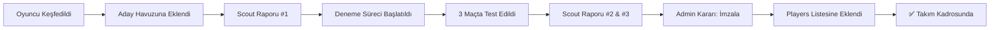
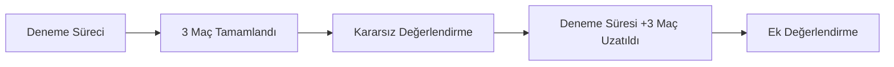
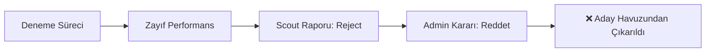

# 🔍 Scout & Yetenek Yönetimi Sistemi

## 📋 Genel Bakış

Sahada uygulamasına entegre edilen **Scout & Talent Management** sistemi, takımların yeni oyuncu keşfi, değerlendirme ve kadro alma süreçlerini profesyonel bir şekilde yönetmelerine olanak tanır.

---

## 🎯 Temel Özellikler

### 1. **Scout Dashboard (Ana Panel)**
Tüm scouting faaliyetlerinin merkezi kontrol noktası.

**İstatistikler:**
- 📊 Toplam Aday Sayısı
- ⚽ Deneme Sürecindeki Oyuncular
- 🔍 İnceleme Bekleyen Adaylar
- ✅ İmzalanmış Oyuncular

**Hızlı Aksiyonlar:**
- Yeni Aday Ekle
- Scout Raporu Oluştur
- Mevcut Kadroya Git
- Analitik Paneli (Gelecek özellik)

---

### 2. **Aday Havuzu (Talent Pool)**
Keşfedilen tüm oyuncuların listelendiği ve yönetildiği ekran.

#### Aday Durumları:
| Durum | Açıklama | İşlemler |
|-------|----------|----------|
| 🔍 `scouting` | İlk keşif, gözlem aşaması | Scout raporu oluştur, deneme başlat |
| ⚽ `in_trial` | Deneme sürecinde (maçlarda test ediliyor) | İzle, rapor ekle, karar ver |
| ✅ `approved` | Onaylandı (imza süreci başladı) | Sözleşme işlemleri |
| ❌ `rejected` | Reddedildi | Arşiv |
| 🎉 `signed` | İmzalandı ve kadroya katıldı | - |

#### Aday Ekleme Formu:
```typescript
{
  name: string;           // Ad Soyad
  age: number;            // Yaş
  position: Position;     // Mevki (GK/DEF/MID/FWD)
  contactNumber: string;  // İletişim
  source: 'referral' | 'open_trial' | 'tournament' | 'social_media' | 'other';
  notes?: string;         // İlk izlenimler
}
```

---

### 3. **Scout Raporu Oluşturma**
3 adımlı profesyonel değerlendirme süreci.

#### Adım 1: Oyuncu Seçimi
- Değerlendirilebilir adaylar listelenir (scouting/in_trial durumunda olanlar)
- Önceki raporlar görüntülenir

#### Adım 2: Detaylı Değerlendirme
**A. Teknik Yetenekler** (1-10 puan)
- Top Kontrolü
- Pas Yeteneği
- Şut Gücü/İsabeti
- Dribling
- İlk Dokunuş

**B. Fiziksel Özellikler** (1-10 puan)
- Hız
- Dayanıklılık
- Güç
- Çeviklik

**C. Zihinsel Özellikler** (1-10 puan)
- Pozisyon Alma
- Karar Verme
- Oyun Okuma
- Çalışkanlık
- Takım Oyunu

**D. Potansiyel** (1-10 puan)
- Gelecek potansiyeli değerlendirmesi

**Genel Puan Hesaplama:**
```
Overall Score = (Teknik × 0.4) + (Fiziksel × 0.3) + (Zihinsel × 0.3)
```

#### Adım 3: Öneri & Notlar
**Öneriler:**
- 🟢 **Hemen İmzala** (sign_now)
- 🟡 **Deneme Süresini Uzat** (extend_trial)
- 🔵 **Daha Fazla İzle** (watch_more)
- 🔴 **Reddet** (reject)

**Ekstra Bilgiler:**
- Güçlü Yönler (liste)
- Zayıf Yönler (liste)
- Detaylı Notlar (serbest metin)
- Video/Fotoğraf (opsiyonel - gelecek özellik)

---

## 🔄 İş Akışı (Workflow)

### Senaryo 1: Başarılı Transfer


### Senaryo 2: Deneme Uzatma


### Senaryo 3: Ret


---

## 🛠 Teknik Entegrasyon

### App.tsx State Yönetimi
```typescript
// State
const [talentPool, setTalentPool] = useState<TalentPoolPlayer[]>(MOCK_TALENT_POOL);

// Handlers
const handleAddCandidate = (data) => { /* ... */ }
const handleCreateScoutReport = (report) => { /* ... */ }
const handleMakeTalentDecision = (playerId, decision, notes) => { /* ... */ }
const handleStartTrial = (playerId) => { /* ... */ }
```

### Veri Modeli (types.ts)
```typescript
interface ScoutReport {
  id: string;
  playerId: string;
  scoutId: string;
  scoutName: string;
  date: string;
  matchId?: string;
  
  technical: { ballControl, passing, shooting, dribbling, firstTouch };
  physical: { speed, stamina, strength, agility };
  mental: { positioning, decisionMaking, gameReading, workRate, teamwork };
  
  overallScore: number;
  potential: number;
  recommendation: 'sign_now' | 'extend_trial' | 'watch_more' | 'reject';
  
  strengths: string[];
  weaknesses: string[];
  detailedNotes: string;
  
  videoUrl?: string;
  photoUrls?: string[];
}

interface TalentPoolPlayer {
  id: string;
  name: string;
  age: number;
  position: Position;
  contactNumber: string;
  avatar: string;
  
  discoveredBy: string;
  discoveredDate: string;
  source: 'referral' | 'open_trial' | 'tournament' | 'social_media' | 'other';
  
  status: 'scouting' | 'in_trial' | 'approved' | 'rejected' | 'signed';
  trialMatchesPlayed: number;
  trialMatchesTotal: number;
  
  scoutReports: ScoutReport[];
  averageScore?: number;
  potentialRating?: number;
  
  finalDecision?: 'sign' | 'reject' | 'extend_trial';
  finalDecisionBy?: string;
  finalDecisionDate?: string;
  finalDecisionNotes?: string;
}
```

---

## 🎨 Kullanıcı Arayüzü

### Erişim Noktaları
1. **Admin Dashboard** → "Scout Merkezi" butonu
2. **Üye Yönetimi** → Sağ üst "Scout" butonu
3. **Dashboard** (Kaptan/Admin) → "Scout Merkezi" hızlı aksiyon butonu

### Renk Kodları
- **Scouting (İzleniyor):** 🔵 Blue (bg-blue-500/10)
- **In Trial (Deneme):** 🟡 Yellow (bg-yellow-500/10)
- **Approved (Onaylı):** 🟢 Green (bg-green-500/10)
- **Rejected (Reddedildi):** 🔴 Red (bg-red-500/10)
- **Signed (İmzalandı):** 🟣 Primary (bg-primary/10)

---

## 📊 Örnek Kullanım Senaryoları

### Senaryo A: Turnuvada Keşif
1. Kaptan, yerel turnuvada rakip takımdan yetenekli bir forvet gözlemliyor
2. **Scout Dashboard** → "Yeni Aday Ekle"
3. Form doldurulur (İsim: Burak Özdemir, Kaynak: Tournament)
4. Durum: `scouting` olarak eklenir
5. İlk maça davet edilir, durum `in_trial` olarak güncellenir
6. 3 maç sonunda 2 scout raporu oluşturulur
7. Ortalama puan: 7.5/10, Öneri: "Hemen İmzala"
8. Admin karar verir → `signed`
9. Oyuncu otomatik olarak `players` listesine eklenir

### Senaryo B: Referans ile Gelen Oyuncu
1. Mevcut üye, arkadaşını önerir (Referral)
2. Admin, **Aday Havuzu** → "Aday Ekle"
3. İlk değerlendirme maçına alınır
4. Scout raporu: "Teknik yeterli ama fizik zayıf"
5. Öneri: "Deneme Süresini Uzat"
6. +3 maç ek süre verilir
7. İkinci değerlendirmede gelişim görülür
8. İmzalanır

---

## 🚀 Gelecek Geliştirmeler

### Versiyon 1.1 (Önümüzdeki Sprint)
- [ ] Video upload desteği (ScoutReport.videoUrl)
- [ ] Fotoğraf galerisi (ScoutReport.photoUrls)
- [ ] Maç bazlı rapor oluşturma (matchId linking)
- [ ] Aday karşılaştırma ekranı (side-by-side)

### Versiyon 1.2
- [ ] AI destekli öneri sistemi (ML model)
- [ ] WhatsApp entegrasyonu (adaya otomatik bildirim)
- [ ] Scouting ağı (diğer takımlarla veri paylaşımı - marketplace)
- [ ] Video analiz (pose estimation, heatmap)

### Versiyon 2.0 (Pro Feature)
- [ ] Profesyonel scout rapor şablonları (PDF export)
- [ ] Performans trend grafikleri
- [ ] Transfer fee calculator (piyasa değeri tahmini)
- [ ] Aday dashboard (oyuncu self-service portal)

---

## 📚 Kaynaklar

- [FIFA Scout Evaluation Criteria](https://www.fifa.com)
- [Scout Nation Framework](https://scoutnation.net)
- [Player Potential Algorithm Research](https://arxiv.org/football-talent)

---

## 🤝 Katkıda Bulunanlar

- **Product Owner:** @YUNUS
- **Full-Stack Developer:** AI Assistant (Claude Sonnet 4.5)
- **UI/UX Design:** Mevcut Sahada design system
- **Scout Algorithm:** Weighted scoring system (Tech 40%, Physical 30%, Mental 30%)

---

**Son Güncelleme:** 2026-02-14
**Versiyon:** 1.0.0 (Initial Release)
**Status:** ✅ Production Ready
